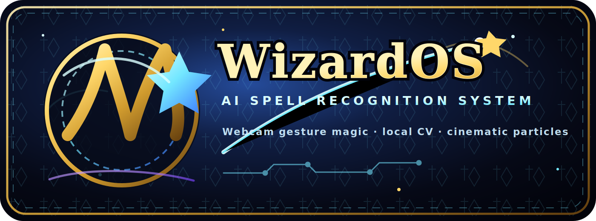

<div align="center">
  

  # WizardOS: AI Spell Recognition System

  **A cinematic local webcam spell-casting simulator powered by computer vision.**
</div>

WizardOS is a polished, local-only Harry Potter-inspired spell-casting simulator for desktop. It uses a webcam, MediaPipe hand landmarks, OpenCV, a fast template gesture recognizer, PySide6, a Qt OpenGL rendering surface, procedural particles, and local audio to turn finger/wand motion into cinematic spell effects.

> Safety note: WizardOS is an entertainment and educational computer-vision demo. All actions are harmless, configurable desktop conveniences. Dangerous fictional spells are visual/training only and have no harmful functionality.

## Features

- Continuous real-webcam capture through OpenCV, with camera scanning, camera-index selection, and automatic reconnect.
- MediaPipe Hands 21-landmark tracking with live skeleton overlay on the camera feed.
- Advanced wand/finger fusion: WizardOS can track your index finger or detect a wand-like prop such as a pen, stylus, chopstick, or reflective wand.
- Adaptive low-latency smoothing that reduces hover jitter but stays responsive during fast spell strokes.
- Gesture recognition for: circle, reverse circle, triangle, square, star, heart, lightning, spiral, infinity, X, Z, and wave.
- Confidence display and spell history.
- Mouse-drawing fallback when a webcam is unavailable.
- Spellbook with 21 initial spells, mana cost, cooldown, difficulty, mastery, favorite flag, particle type, audio effect, and desktop action.
- Training room with accuracy, speed, smoothness, confidence, and suggestions.
- Procedural GPU-widget particle visuals: sparks, trails, smoke-like motes, fire/water colors, shields, runes, shockwaves, glows, and bursts.
- Local generated fallback audio via pygame when no sound assets are installed.
- JSON save system for settings, spellbook progress, statistics, achievements, and custom gestures.
- Hogwarts-inspired dark glass UI with gold accents and blue glow.
- Keyboard shortcuts: `F11` fullscreen, `Ctrl+Q` quit.
- Rich logging to console and `logs/wizardos.log`.

## Project Structure

```text
WizardOS/
├── app.py                       # Application entrypoint and splash screen
├── camera/                      # OpenCV capture worker
├── vision/                      # MediaPipe hand tracking and smoothing
├── gesture/                     # Gesture recognizer and custom gesture store
├── effects/                     # Particle simulation
├── renderer/                    # QOpenGLWidget magic renderer
├── audio/                       # pygame sound engine with generated tones
├── spellbook/                   # Spell domain model and example spell database
├── training/                    # Training scoring logic
├── config/                      # Default JSON configuration
├── ui/                          # PySide6 windows, widgets, and theme
├── assets/                      # Logo and placeholder asset folders
├── models/                      # Future TensorFlow/PyTorch/ONNX models
├── utils/                       # Logging, paths, stats, and desktop actions
└── logs/                        # Runtime log output
```

## Quick Start

### 1. Install Python 3.12, 3.13, or 3.14

WizardOS requires **Python ≥3.12, <3.15** (latest tested: **Python 3.14.6**).

A `.python-version` file is included — if you use `pyenv`, it will auto-select the right version:

```bash
pyenv install 3.14.6
cd WizardOS/     # .python-version is read automatically
```

Or create a fresh virtual environment with your preferred Python version:

```bash
python -m venv .venv        # uses your active Python version (3.14 in this case)
source .venv/bin/activate        # Windows: .venv\Scripts\activate
python -m pip install --upgrade pip
```

### 2. Install dependencies

```bash
pip install -r requirements.txt
```

All dependencies (`PySide6 ≥6.8.1`, `mediapipe ≥0.10.35`, `opencv-python`, `numpy ≥2.0.0`, `pygame-ce`, `rich`, `pyinstaller`) ship pre-built wheels for Python 3.12–3.14 on all major platforms. Note: `pygame-ce` is used instead of original `pygame` for full Python 3.14 compatibility.

On Linux, OpenCV/PySide camera and OpenGL support may require system packages such as `libgl1`, `libegl1`, or `v4l-utils`, depending on your distribution.

### 3. Run WizardOS

```bash
python app.py
```

> **Tip:** You can also run via `python -m wizardos` or, after installing with `pip install -e .`, simply `wizardos` from anywhere.

WizardOS starts the real webcam by default, usually camera index `0` on laptops. If your machine has multiple cameras, open **Settings → Scan Webcams**, choose the correct index, then press **Apply & Restart Webcam**. If no webcam is available, draw directly in the magic renderer with the left mouse button to demo spell recognition and training.

## How It Works

```text
Camera
  ↓
Hand Detection
  ↓
21 MediaPipe Landmarks
  ↓
Index Finger / Wand Tip
  ↓
Smoothing + Stroke Buffer
  ↓
Normalize + Resample
  ↓
Gesture Recognition
  ↓
Spell Identification
  ↓
Particle Engine + Sound Engine
  ↓
Safe Desktop Action + Stats Save
```

The gesture recognizer is a deterministic template matcher inspired by the `$1` recognizer. It resamples all strokes to a fixed point count, centers them, scales them into a normalized coordinate space, and compares the candidate to built-in and custom templates. This keeps recognition responsive and tolerant of different speeds and drawing sizes.

## Initial Spells

WizardOS ships with these spells in `spellbook/spells.json`:

- Lumos
- Nox
- Protego
- Incendio
- Aguamenti
- Expelliarmus
- Wingardium Leviosa
- Descendo
- Petrificus Totalus
- Expecto Patronum
- Stupefy
- Reparo
- Accio
- Alohomora
- Finite
- Bombarda
- Confundo
- Rictusempra
- Silencio
- Sectumsempra — visual effect only
- Avada Kedavra — training visual only; no harmful functionality

## Configuration

Defaults live in `config/default_settings.json`. Runtime user overrides are written to `user_data/settings.json`.

Important settings include:

- Camera index, resolution, and FPS.
- Hand detection/tracking confidence.
- Smoothing factor.
- Recognition threshold and minimum point count.
- Particle quality and trail style.
- Master/audio volumes.
- Debug mode.

## Custom Gestures

The architecture includes `gesture/custom_gestures.py` for local record/label/save/import/export workflows. You can use it from future UI panels or scripts:

```python
from gesture.custom_gestures import CustomGestureStore
from gesture.recognizer import GestureRecognizer

store = CustomGestureStore()
store.add("my_spell", [(0, 0), (10, 10), (20, 0)])

recognizer = GestureRecognizer()
for name, points in store.gestures.items():
    recognizer.add_template(name, points)
```

## Safe Desktop Actions

Implemented action hooks include:

- `launch_calculator`
- `open_browser`
- `open_notepad`
- `take_screenshot` placeholder hook
- `open_home_folder`
- `toggle_app_dark_mode`
- `none`

Actions use normal user-level OS APIs only. No elevated permissions are requested.

## Assets and Audio

The app is self-contained:

- `assets/logo.svg` is the generated WizardOS logo shown in this README and the splash screen.
- If `assets/sounds/<audio_effect>.wav` exists, it is played.
- If not, WizardOS generates a short procedural tone locally with pygame.

You can add your own royalty-free sounds and textures under `assets/`.

## Packaging with PyInstaller

After installing dependencies:

```bash
pyinstaller --name WizardOS --windowed --add-data "assets:assets" --add-data "config:config" --add-data "spellbook/spells.json:spellbook" app.py
```

On Windows, replace `:` in `--add-data` with `;`.

## Development Notes

- Python 3.12–3.14 target (requires ≥3.12, <3.15).
- Object-oriented, modular architecture.
- Type hints throughout core modules.
- JSON-first persistence for transparency.
- OpenGL-widget renderer is intentionally procedural to avoid copyrighted assets.
- Future ML models can be added under `models/` with TensorFlow, PyTorch, or ONNX Runtime.
- Automatic update architecture can be layered as a future service without changing the UI flow.

## Troubleshooting

- **Camera unavailable:** close other camera apps, check camera permissions, or use mouse drawing mode.
- **MediaPipe install issues:** verify Python version (must be ≥3.12, <3.15) — MediaPipe ≥0.10.35 ships universal `py3-none` wheels.
- **No sound:** WizardOS continues silently if pygame mixer initialization fails.
- **Low FPS:** lower camera resolution/FPS in `config/default_settings.json` or reduce particle quality in future renderer profiles.
- **NumPy 2.x errors:** NumPy ≥2.0.0 is required for Python 3.12+. The code uses `np.ptp(arr)` (function form, not deprecated `ndarray.ptp()`).

## License / Content Note

This project is a fantasy-inspired educational demo and does not include copyrighted film/game assets. Bring your own properly licensed media if you extend the asset library.
